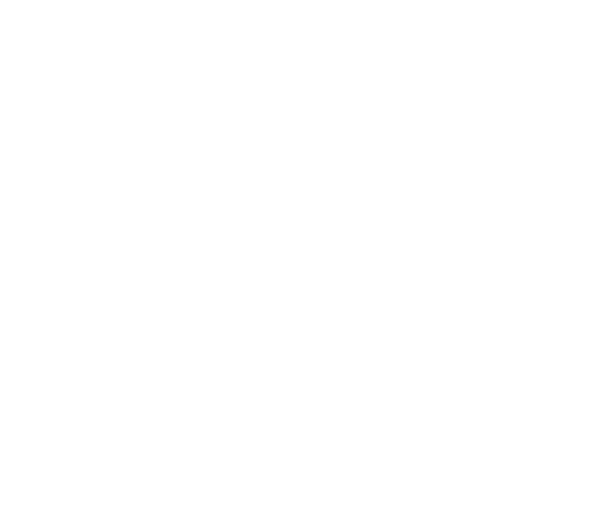

<h1 align="center"> Hello, I’m Jose Antonio 👋</h1>

    
               

Currently working as backend developer at **Everst**.  

<h3 align="center">💻 I like to code with</h3>

    
       
    &nbsp;
      
    &nbsp;
         
    &nbsp;
         
    &nbsp;
    

<h3 align="center">🧪 I’m learning</h3>

 
    
    &nbsp;
           
    &nbsp;
      

<h3 align="center">Connect with me:</h3>

  &nbsp;

&nbsp;
 
  &nbsp;

 

    

<!-- asd
- 🌱 I’m currently learning ...
- 👯 I’m looking to collaborate on ...
- 🤔 I’m looking for help with ...
- 💬 Ask me about ...
- 📫 How to reach me: ...
- 😄 Pronouns: ...
- ⚡ Fun fact: ...
-->
